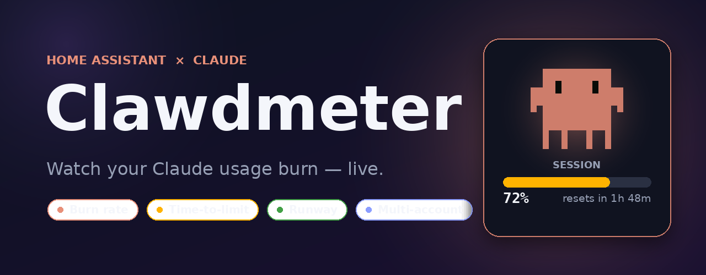
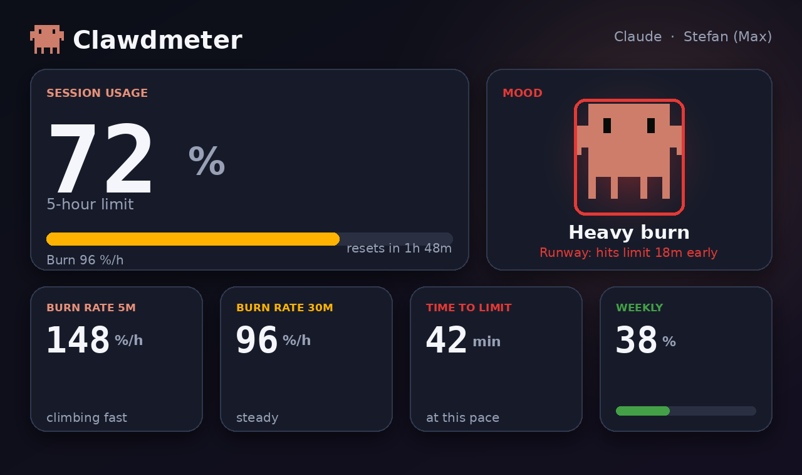
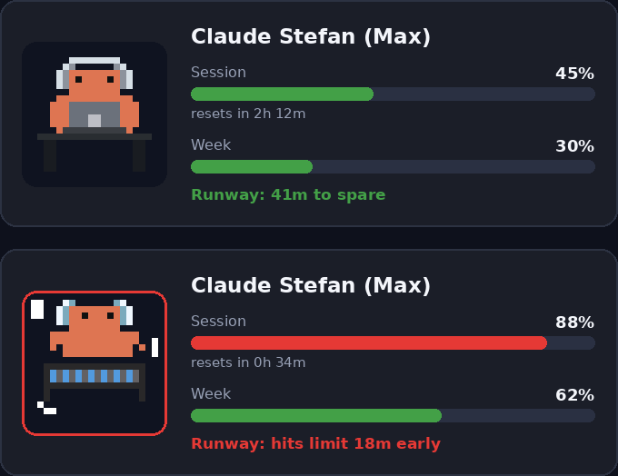

<p align="center">
  
</p>

<h1 align="center">Clawdmeter — Claude Usage for Home Assistant</h1>

<p align="center"><em>Know exactly how much Claude you have left — and how fast you're burning it.</em></p>

<p align="center">
  <a href="https://hacs.xyz"></a>
  
  
  
</p>

Clawdmeter polls Anthropic's usage API and turns it into a full set of Home Assistant
sensors — session and weekly limits, reset countdowns, and a layer of **computed
metrics the API doesn't give you**: live burn rate, time-to-limit, a "runway" verdict
and a color-coded pace frame. Built to pair with the pixel-art Clawdmeter ESPHome
display, but great on its own dashboard too.

## ✨ Highlights

- **Session, weekly & Sonnet usage** with reset timestamps and a live "resets in" countdown.
- **Burn rate (5 min & 30 min)** in %/h — see how fast you are spending right now.
- **Time to limit** — minutes until you hit 100% at the current pace.
- **Runway** — does the session reset before you run out? You get a pace ratio, a signed
  margin and a "limit reached before reset" alert.
- **Pace frame & animation mood** — green/orange/red plus idle→heavy buckets, ready to
  drive a dashboard accent or an ESPHome creature.
- **Extra usage / overage** — credits, limit and percentage (legacy *and* new spend API).
- **Multi-account** — run a Pro and a Max account side by side; each gets its own device.
- **English & German** UI out of the box, plus a configurable poll interval.

<p align="center">
  
</p>

## 📊 Entities

Every account becomes one device named `Claude <name> (<plan>)`, so entities read as
`claude_<name>_<plan>_<type>`. In the device view they split into two groups: the
locally **computed** projections are the primary **Sensors**, and the **raw API**
readings sit under **Diagnostic**.

**Sensors** — computed by the integration:

| Group | Entities |
| --- | --- |
| Burn rate | Burn rate 5m · Burn rate 30m · Burn rate per minute · Usage rate |
| Projection | Time to limit · Session limit ETA |
| Runway | Runway pace · Runway margin · Limit reached before reset |
| Pace & peaks | Weekly pace · Session resets in · Session usage peak today |
| Mood | Animation group · Pace frame |

**Diagnostic** — straight from the usage / profile API:

| Group | Entities |
| --- | --- |
| Account | Account · Plan |
| Usage | Session usage · Weekly usage · Weekly Sonnet usage · Weekly Opus usage |
| Resets | Session reset · Weekly reset · Weekly Sonnet reset · Weekly Opus reset |
| Overage | Extra usage · Extra usage credits · Extra usage limit · Extra usage enabled |

## 💤 States when Claude is idle

When nobody is using Claude — nights, weekends, holidays — the limits aren't moving.
Instead of showing "unknown" everywhere, Clawdmeter reports per-entity idle states that
keep history graphs continuous and meaningful:

| Entity | Idle state | Why |
| --- | --- | --- |
| Burn rate 5m / 30m · Usage rate | `0` | No consumption means zero burn — and a gap-free graph over nights and weekends |
| Runway pace | `0` | At this pace the limit is never reached |
| Pace frame · Animation group | `green` · `idle` | Calm creature |
| Limit reached before reset | `off` | Nothing at risk |
| Time to limit · Runway margin | `unknown` | No ETA exists while usage is flat — a `0` would wrongly read as "at the limit now" |
| Usage %, resets, extra usage | live API value | Reflect the account regardless of activity |

## 🚀 Installation

**HACS (recommended)**

1. HACS → ⋮ → **Custom repositories** → add this repository, category **Integration**.
2. Install **Clawdmeter**, then restart Home Assistant.
3. **Settings → Devices & Services → Add Integration → Clawdmeter**.

**Manual** — copy `custom_components/clawdmeter` into your `config/custom_components/`
and restart.

## 🔑 Configuration

Clawdmeter authenticates with Anthropic over OAuth — there is no API key to manage:

1. Start the integration and open the authorization link it shows you.
2. Approve access and copy the code Anthropic displays (it may contain a `#` — copy the
   whole thing).
3. Paste it back and you are done. Add more accounts by repeating with a different login.

Tune how often it polls under the integration's **Configure** button (60–3600 s, default
300). The usage API is rate limited, so keep it sensible.

## 🃏 Animated Lovelace card

Clawdmeter ships a custom card that draws the **real pixel-art creature** (the original
[Clawdmeter](https://github.com/HermannBjorgvin/Clawdmeter) / [claudepix](https://claudepix.vercel.app)
animations) right on your dashboard. The creature's mood follows your burn rate
(idle → heavy) and its frame glows green/orange/red with the runway pace — exactly like
the ESPHome display.

<p align="center">
  
</p>

**Install the card**

1. Copy `lovelace/clawdmeter-card.js` into your `config/www/` folder.
2. **Settings → Dashboards → ⋮ → Resources → Add resource** → URL `/local/clawdmeter-card.js`,
   type **JavaScript Module**.
3. Add **Clawdmeter Card** from the card picker, or paste the YAML below.

**Panel layout**

```yaml
type: custom:clawdmeter-card
session_usage: sensor.claude_stefan_max_session_usage
session_reset: sensor.claude_stefan_max_session_reset
week_usage: sensor.claude_stefan_max_weekly_usage
animation_group: sensor.claude_stefan_max_animation_group
pace_frame: sensor.claude_stefan_max_pace_frame
runway_margin: sensor.claude_stefan_max_runway_margin
```

**Hero layout** — the banner look, as a live card:

```yaml
type: custom:clawdmeter-card
layout: hero
session_usage: sensor.claude_stefan_max_session_usage
session_reset: sensor.claude_stefan_max_session_reset
animation_group: sensor.claude_stefan_max_animation_group
pace_frame: sensor.claude_stefan_max_pace_frame
```

Only `animation_group` is needed for the creature to move; every other entity is optional
and simply fills in more of the card.

## 🐾 ESPHome companion

These sensors are designed to feed the animated **Clawdmeter** pixel-art display in
[esphome-modular-lvgl-buttons](https://github.com/corgan2222/esphome-modular-lvgl-buttons):
the creature's mood and the breathing pace frame come straight from the metrics above.

## 🔍 Diagnostics

From the device page choose **⋮ → Download diagnostics** to get the raw `usage` and
`profile` API responses side by side with the values the integration stores — handy for
spotting fields Anthropic returns that aren't surfaced as entities yet. Tokens, e-mail
and account identifiers are redacted, but the field names are kept.

## 📈 History & trends

Every percentage sensor is a `measurement`, so Home Assistant records its long-term
statistics automatically. Drop a **Statistics graph** card on, say, _Session usage_ or
_Session usage peak today_ to get daily / weekly / monthly trends (min, max, mean) — no
extra configuration needed.

## 🔔 Usage alerts

The integration ships an automation blueprint
(`blueprints/automation/usage_alert.yaml`) that fires an action when a chosen usage
sensor rises above a threshold.

1. Copy it to `config/blueprints/automation/clawdmeter/usage_alert.yaml` (or import it
   from its raw URL via **Settings → Automations & scenes → Blueprints → Import**).
2. Create an automation from **Clawdmeter usage alert**, pick a sensor (e.g. _Session
   usage_), a threshold (e.g. 80 %), and the action (e.g. a notification).

For the "you'll hit the limit before it resets" case, just trigger on the
_Limit reached before reset_ binary sensor instead.

## 🙏 Credits

- [HermannBjorgvin/Clawdmeter](https://github.com/HermannBjorgvin/Clawdmeter) — the original creature and concept.
- [trickv/hass-claude-usage](https://github.com/trickv/hass-claude-usage) — the reference integration this build reworks.
- [esphome-modular-lvgl-buttons](https://github.com/corgan2222/esphome-modular-lvgl-buttons) — the ESPHome Clawdmeter display.

## 📄 License

Released under the MIT License.
